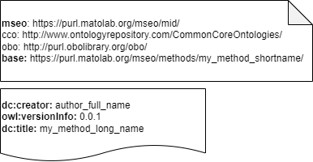
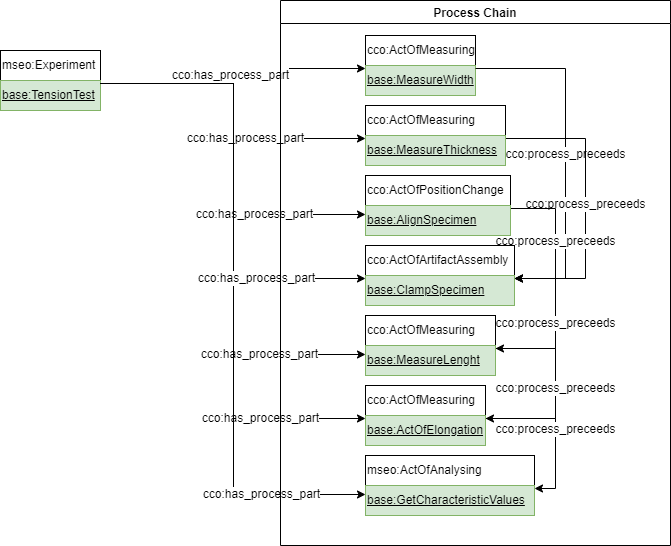
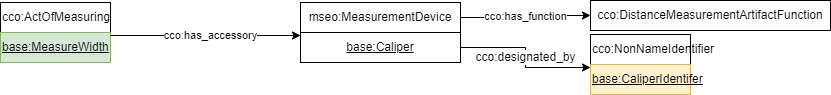
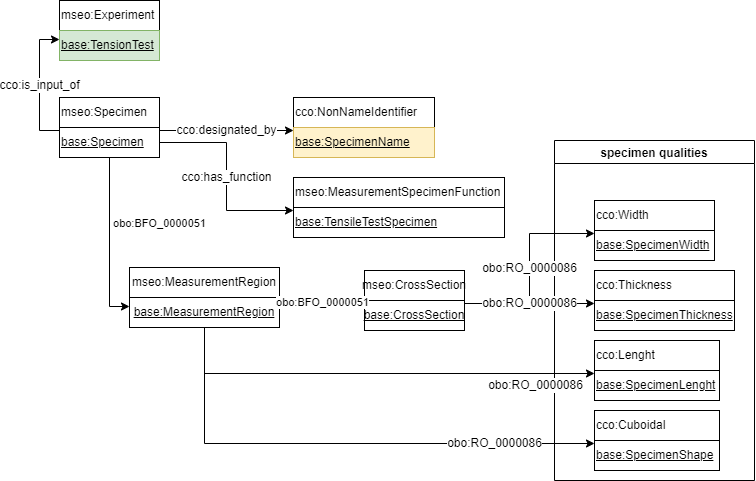
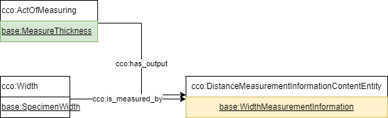

# Develop Method Graphs
Methode Graphs are developed using open source draw.io for example as WebApp at https://app.diagrams.net/
Ontology entities are represented by shapes avaiable after opening the library at https://chowlk.linkeddata.es/resources/chowlk-drawio-library.xml

We provide addition predefined shapes you might find useful here: [MSEO_Method_Parts](MSEO_Method_Parts.xml)

Finished graphes are converted in UI at https://chowlk.linkeddata.es
or if uploaded in this folder automatically on changes by a github action.

## How to Begin
Start with a blank canvas! Then define the head of your graph.
### Head

Change the entries according our needs. The base prefix should be used to declare the namespace of this graph.

Every graph should begin with a root node representing the method, which will be refined with semantic expressions. This guide will use a very generic Tension Experiment as example where a rectangular specimen is elongated in a tesing machine.

We suggest to begin with the chain of the processes involved to achieve the result of the method.
### Process Chain

All Processes are related to the root node by the relation cco:has_process_part. The order of events can be defined through use of the relation cco:process_preceeds

### Accessory

In a next step you should point out every accessory needed for measurements and equipment that must be referenced to. That might be a MeasurementDevice like in the example, but also reference objects like certain measurements standards for comparisons or sensors or machines.

The mseo:MeasurementDevice in the example is an subclass of cco:Artifact which are objects with at least one function. Connecting such a Artifact with a certain process makes sure that, if the process outputs a measurement, the acccessory with the appropriate function is in relation to that.

### Specimen
Specimen are defined by a subclass of cco:Artifact having the function MeasurementSpecimenFunction.
They must have an Identfier as a subclass of cco:DesignativeInformationContentEntity attached.

Your can define spatial Regions like a desired region where the measurement is carried out through has_part (obo:BFO_000051) relation. Geometry features and other qualitys of the specimen relevant are attached to the Specimen or specific parts of it through has_quality (obo:RO_000086) relation.

### Measurements

Measured Values are typically output of processes. CCO provides a set of subclasses of cco:MeasurementInformationContentEntity specifying what is actually measured. The concept how they are categorized might not sound familiar but very much makes sense. See this [article](https://en.wikipedia.org/wiki/Level_of_measurement) for more information.

The MeasurementInformationContentEntities are connected to the quality they measure by the relation cco:is_measured_by.

### Changes and Effects
