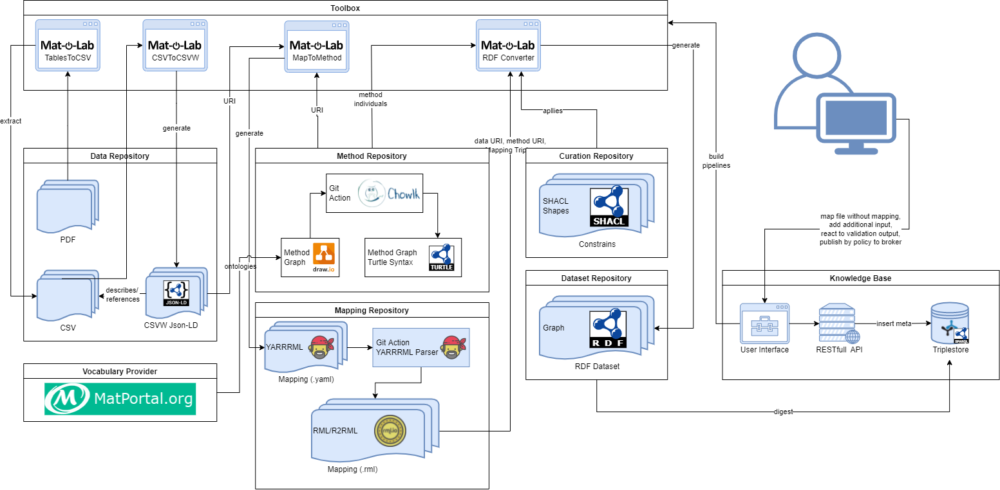

# RDF Pipeline 

In the figure the intended pipeline for the automateable creation of rdf data is illustrated.
The process focused on CSV data for know, but was created to be adoptable for other file formats.
All services of the Toolbox are containerized, the test pipeline workflow can be found in [TestPipeline.yml](https://github.com/Mat-O-Lab/MSEO/blob/main/.github/workflows/TestPipeline.yml)

